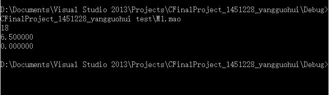
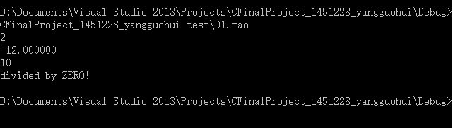

#Mao Language Interpreter

####Demo1:
M1.mao

	int a, b, c, d;
	double e, f,g;
	a=b=c=d=1+3+4+5*2+b;
	print(a);
	e=2*a/b/c+13.0/2;
	print(e);
	b/c/d/a;
	print(f);`

####Demo2:
D1.mao

	int a;
	double x, y;
	int b,c,d;
	a=5.5;
	x=y=(1+a)*6.44;
	a+4;
	a=a/2;
	print(a);
	y=(c+6)*-(1+1);
	print(y);
	(a)=a+(d=3.5+4.5);
	print(a);
	d=a/(2/5);
	print(d);	

##Background
This is the [final project](Requirements.pdf) of my C-programming course. Actually I can finish this in a easier way. However, after reading the first three chapter of *Dragon Book*, I made the decision to try to put what I learn into pratice. So it was this program, still a very simple one though.

###About Mao Language
Brother Mao, who is a living lengend of SSE, TJ Univ., found that C language is not elegant enough, so he invented Mao Language based on C language on his own.

####Syntax Elements
- Reserved words: `int, double, print`
- Identifier: **Letter** (**Letter** | **Digit**)* 
- Literals: [+|-] **Digit** 
- Legal symbols:` + - * / = ( ) , ;`

####Program Structure
- Basic element is statement.
- One line for each statement and end with semicolon. No blank lines.
- (In my implementation) All the statements can be divided into three types: Declarations, Print, Others.

####Variables
- Only primitive data types: integer(32 bit), floating point(64 bit).
- Type conversion: Implicit conversion.

####Statements
- Assignments: 
	- `Id = Expression;`
	- ` (Id) = Expression;`
- Print statements: 
	- `print(Expression);`
- Others;
	- `Expression;`

####Expressions
Expressions must be one of following cases: 

- Literals
- Identifiers
- Expressions that have unary operator as prefix
- `(Expression)`
- `Expression operator Expression`, operators can be one of these(binary operators): + - * / =

##Introduction to project

###How to compile and run
In Windows environment, you could run the makefile with GCC/G++(4.8.1 or higher), after that you would get MaoLang.exe. Testcase files should be passed in as the first argument of command lines, as what is shown in demo before.

###Modules
MaoLang Interpreter mainly consist of three parts: Scanner, Parser, Storage.

####Scanner
Source code: scanner.c, scanner.h

The scanner receives a statement, a stream of characters from the main function as input, then tells the parser what kind of statement it is and delivers a processed stream of characters to the parser. Meanwhile, scanner can deal with the variables declarations.

Source code is organized as follows:

	//Scanner.c
	void scan()
	{
		if (is declarations)
		{
			check if it's legal id;
			add a new variable and initialize to zero;
		}
		else if (is print)
		{
			pass the statements to parser to get expression;
			get result of the expression;
			print the result into the stdout;
		}
		else
		{
			pass the statements to parser to get expression;
			get result of the expression;
		}
		return;
	}

####Parser
Source code: parser.c, parser.h

Parser receives a stream of characters from scanner, judges if it's a legal expression, and generates an AST. It's implemented with recursive descendent method.

To put it clearly, we can see the syntax of Mao Language in details.

#####Syntax of Mao Language
The syntax of mao language is defined as follows with BNF, for brevity, here is  the key parts:

	stmt -> assign
	
	assign -> lvalue = assign
			| lvalue = expr
	
	expr -> term + expr
		  | term - expr
		  | term

	term -> factor * term
		  | factor / term
		  | factor

	factor -> (expr)
			| num
			| id

	lvalue -> id
			| (id)

#####Abstract Syntax Tree

- The type of the tree node:

		typedef struct _expression
		{
			double result;
			struct _expression* left_expr;
			struct _expression* right_expr;
	
			bool is_int;
			bool is_float;
			bool is_variable;

			int sign;
			void* value;
			char* varname;
			char operat;
		} Expression;

- The AST is generated by a series functions named `GetXXX()`. Here is the   pseudocode example for `GetExpr()`

		Expression* GetExpr(char*& input_string)
		{
			New a tree node _expr;
			Try to get a term;
			
			while (1)
			{
				if (operator is "+" or "-")
					get _operator;
				else
					break;

				if (_operator exists)
				{
					if (the term exists)
					{
						New a tree node;
						set newnode.left = _expr;
						set newnode.right = GetTerm();
						set newnode.opeartor = _operator;
						_expr = newnode;
					}
					else
					{
						return NULL;
					}
				}
			}
			
			return _expr;
		}

	
	The other functions are similar with this, you can check them out in the parser.c .

- After parsing we can get an AST,

	For instance, `a = 1 + 2 * 4`, looks like that:

	
	
	It should be noted that the `expression, term, factor...` is not really a node of the tree in practice, it's just the process of analysis instead. Once we have this tree, we can easily get the result of the expressions by doing postorder traversal.

####Variables storage
Source code: trie.c, trie.h .

For each variable there is a name, a type, and a value. The structure "trie tree" is useful here. It's not too difficult to implement and it has good properties as well. That is, by merging the same prefix of the variables' names, plenty of memory can be saved. Moreover, the time cost of searching a certain variables is reduced remarkbly. 

#####The definition of the node of trie

	typedef enum _nodetype
	{
		none, int_var, float_var, num_const
	} Nodetype;

	typedef struct _node
	{
		struct _node *child[LETTER_DIGIT_MAX];
		char node_char;
		Nodetype type;
		void* value;
	} Trienode;

####Others

Manipulate.c, manipulate.h are useful functions for string manipulation in this project.

Stdafx.h includes the header file of C standard libary.

###Story behind

 
